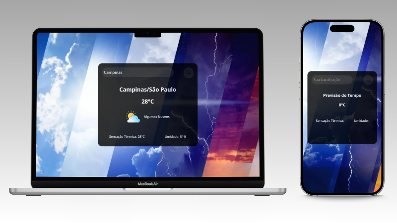

# 🌤️ Weather - Previsão do Tempo 

 
Aplicação simples e prática para consultar informações climáticas em tempo real de qualquer cidade utilizando a API OpenWeatherMap.
 

________________________________________

  
#### 🛠️ Tecnologias Utilizadas

 ________________________________________
 

## 📌 Sobre o Projeto

O Weather – Previsão do Tempo é uma aplicação simples e intuitiva desenvolvida em HTML, CSS e JavaScript, que permite consultar rapidamente o clima de qualquer cidade do mundo.
Utilizando a API OpenWeatherMap, retorna temperatura, umidade, sensação térmica, descrição do clima e um ícone personalizado para condições específicas, que muda conforme o período do dia e as condições meteorológicas.

O foco do projeto é praticar:
- Consumo de APIs externas
- Manipulação do DOM
- Boas práticas de organização de código
- Responsividade para dispositivos móveis
- Lógica de programação 
 

## 🚀 Funcionalidades

#### ✔️	Busca de cidade em tempo real
- Temperatura atual
- Sensação térmica
- Umidade
- Descrição do clima
- Localidade (via API de Geolocalização)
---

#### ✔️	Ícones personalizados por condição climática
- Compara a descrição do clima da API com uma lista
- Verifica se é dia ou noite
- Escolhe automaticamente um ícone personalizado
- Se não encontrar, usa o ícone oficial da OpenWeatherMap(Fallback)
 ---
 #### ✔️ Detecção automática de dia/noite para ícones personalizados
- Horário atual baseado no timezone
- Compara sunrise / sunset
- Retorna "day" ou "night", alterando automaticamente os ícones exibidos.
---
#### ✔️	Validação do input
- O código impede buscas vazias
- Mensagem de erro
- Estilo de input vermelho
- Ícone ocultado

Melhorando a UX.

---
#### ✔️ Interface responsiva
- Desktop
- Smartphone
- Tablet
 

## 🧠 Lógica Principal

✔️ A aplicação recebe o nome de uma cidade digitada pelo usuário, valida o input e então faz duas requisições para a API OpenWeatherMap:

1. Current Weather Data API → para obter temperatura, umidade, sensação térmica, tipo de clima e ícone base..

2. Geocoding API → para obter informações de localização (cidade/estado).

✔️ Com esses dados, o código:

- Determina se é dia ou noite pelo horário local da cidade usando sunrise/sunset.
- Procura no array de ícones personalizados aquele que combina com a descrição da API + período do dia.
- Se achar, exibe o ícone personalizado; se não achar, exibe o ícone padrão da API.
- Mostra tudo organizado na tela (cidade, clima, ícone, detalhes).
- Mostra mensagens de erro caso a cidade não exista ou o input esteja vazio.
  
   
  
---

### 🌐 Veja online

[💻<b>*Abrir Projeto Online*</b>](https://adryelsantoss.github.io/weather-previsao-tempo/)

---

 

  

